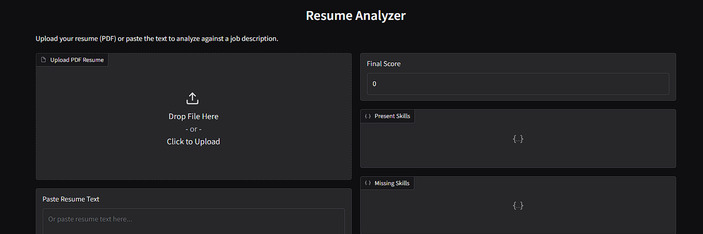
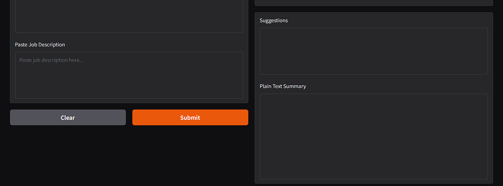
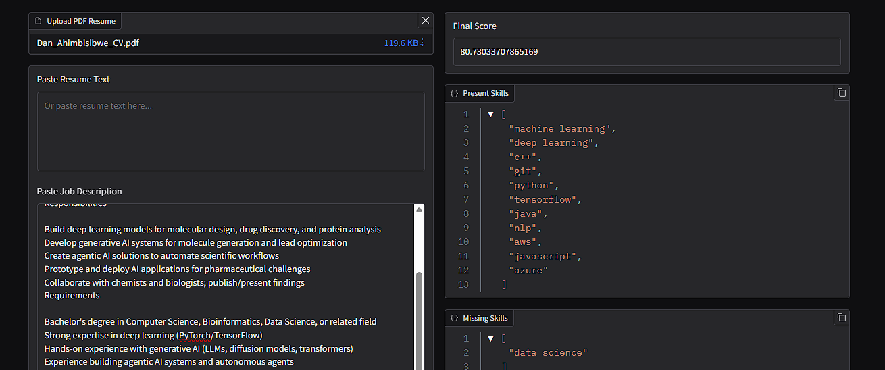
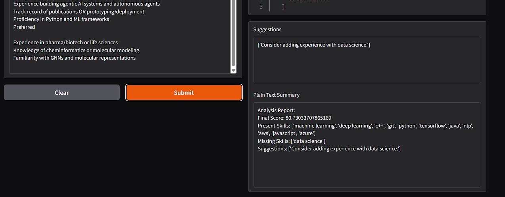

# CrewAI Software Engineer Agent — Case: Resume Analyzer ⚙️🤖📄

This repository demonstrates the **SoftwareEngineer Crew**,  a set of CrewAI-powered agents (Engineering Lead, Backend Engineer, Frontend Engineer, Test Engineer) that collaborate to design and build software automatically.

The **case study implemented here** is an **AI-Powered Resume Analyzer**.  
Given a job description and a resume (PDF or text), the system evaluates skills overlap, computes a compatibility score, and generates improvement suggestions.  

---

## 🧩 How It Works

The **SoftwareEngineer Crew** is configured with roles and tasks:

- **Engineering Lead** → Produces a detailed design document.  
- **Backend Engineer** → Implements the backend Python module.  
- **Frontend Engineer** → Creates a Gradio app to demonstrate the backend.  
- **Test Engineer** → Writes unit tests for the backend.  

The orchestration logic is in `software_engineer/crew.py` and the entry point is `main.py`.  

### Flow:
1. **Run the crew** with the high-level requirements.  
2. Agents generate:  
   - `resume_analyzer_design.md` → design spec  
   - `resume_analyzer.py` → backend code  
   - `app.py` → frontend demo  
   - `test_resume_analyzer.py` → unit tests  
3. Launch the Gradio app to interact with the Resume Analyzer.  

---
## ⚙️ Tech Stack
- Python 3.10+  
- pdfplumber / PyPDF2  
- Regex / scikit-learn (optional)  
- Gradio (for the web UI)  
- Pytest (unit testing)  
- CrewAI (multi-agent orchestration)  

---

## 📸 Screenshots

### Initial UI

### Resume Upload Example

### Results Example

